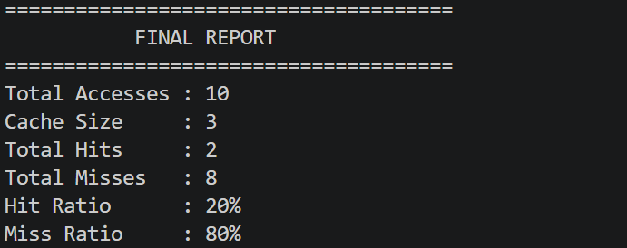

# FIFO Cache Memory Simulator (C++)

## Overview

This project simulates the FIFO (First In First Out) Cache Replacement Algorithm using C++.

It demonstrates how cache memory works by tracking cache hits and misses for a given memory access sequence.

## Features

- User-defined cache size
- User-defined memory access sequence
- FIFO replacement policy
- Cache visualization after every memory access
- Hit and Miss calculation
- Hit Ratio and Miss Ratio

## Technologies Used

- C++
- STL Vector
- VS Code
- GCC Compiler

## Sample Input

Cache Size:
3

Memory Accesses:
10

Sequence:
1 2 3 1 4 2 5 1 2 3

## Sample Output

Hits : 2

Misses : 8

Hit Ratio : 20%

Miss Ratio : 80%

## Algorithm

1. Read cache size.
2. Read memory access sequence.
3. Check whether the requested block is present.
4. If present, it is a Hit.
5. Otherwise, it is a Miss.
6. If the cache is full, replace the oldest block (FIFO).
7. Display cache contents.
8. Print final statistics.

## Future Improvements

- Implement LRU Replacement
- Implement LFU Replacement
- GUI Visualization
- Compare multiple cache algorithms

## Sample Output

## Author

Jyothika M